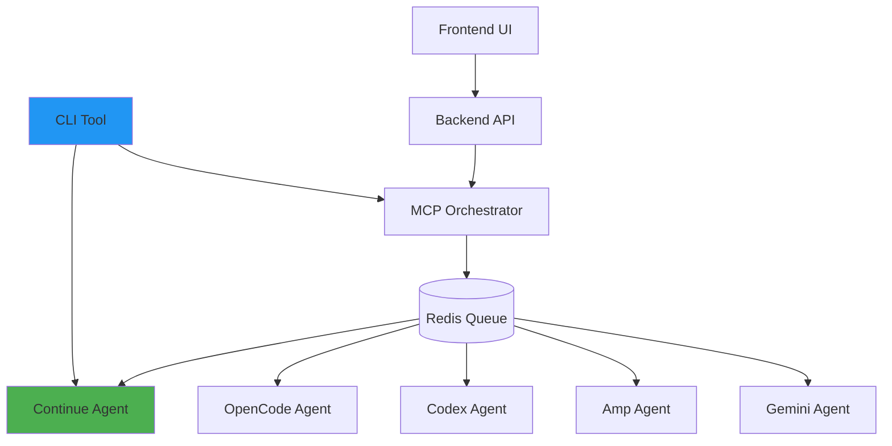

# CLI App - Multi-Agent AI Orchestration Platform

## Quick Start

### Development
```bash
npm run install:all
npm run dev
```

### Access Points
- Frontend: http://localhost:5173
- Backend API: http://localhost:3000
- MCP Orchestrator: http://localhost:8080

## Project Structure

```
cli-app/
├── .devcontainer/          # VSCode devcontainer configuration
├── .github/workflows/      # GitHub Actions (OpenCode integration)
├── .mcp/                   # MCP orchestration system
│   ├── src/
│   │   ├── orchestrator.ts # Main orchestrator
│   │   ├── agents/         # Agent implementations
│   │   └── types.ts        # TypeScript definitions
│   └── README.md           # MCP documentation
├── backend/                # Express.js backend
│   └── src/
├── frontend/               # React + Vite frontend
│   └── src/
├── cli/                    # Command-line interface
│   ├── src/
│   │   ├── commands/       # CLI commands
│   │   └── services/       # API clients
│   └── README.md           # CLI documentation
└── package.json            # Workspace root
```

## MCP Agent System

### Supported Agents
1. **Continue** - Interactive code assistance, chat, review, generation
2. **OpenCode** - PR reviews, issue analysis
3. **Codex** - Code generation, refactoring
4. **Amp** - Complex multi-step tasks
5. **Gemini-CLI** - Analysis, documentation

### Orchestration Modes
- **Parallel**: Multiple agents on independent tasks
- **Sequential**: Pipeline processing
- **Consensus**: Multi-agent voting
- **Specialized**: Route to best agent

## Configuration

Copy `.env.example` to `.env` in each directory:
- `/backend/.env`
- `/.mcp/.env`
- `/cli/.env`

Add your API keys for each agent.

## CLI Usage

### Installation
```bash
npm run build:cli
cd cli && npm link
```

### Commands
```bash
# System status
cli-app status

# Continue AI
cli-app continue chat "Explain this code"
cli-app continue review src/**/*.ts
cli-app continue generate "Create a REST API" --output src/api.ts

# Agent management
cli-app agent list
cli-app agent status continue

# Task management
cli-app task submit
cli-app task list
```

See [cli/README.md](./cli/README.md) for full CLI documentation.

## Testing Commands

```bash
# Backend
cd backend && npm test

# Frontend  
cd frontend && npm test

# MCP Orchestrator
cd .mcp && npm test

# CLI
cd cli && npm test
```

## Build Commands

```bash
# All workspaces
npm run build

# Individual
npm run build --workspace=backend
npm run build --workspace=frontend
npm run build --workspace=.mcp
npm run build --workspace=cli

# Build and link CLI globally
npm run build:cli
cd cli && npm link
```

## Architecture



## Features

- 🤖 **Multi-Agent Orchestration**: Coordinate multiple AI agents
- 💬 **Continue Integration**: Direct CLI access to Continue AI
- 🎯 **Smart Routing**: Automatically select best agent for tasks
- 📊 **Task Queue**: Redis-backed task management
- 🔄 **Real-time Updates**: WebSocket support for live status
- 🎨 **Modern UI**: React-based frontend with Vite
- ⚡ **High Performance**: TypeScript + async processing

## License

MIT
